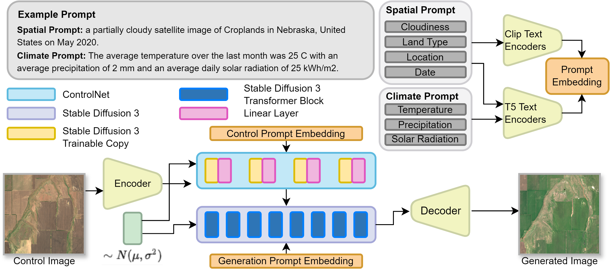
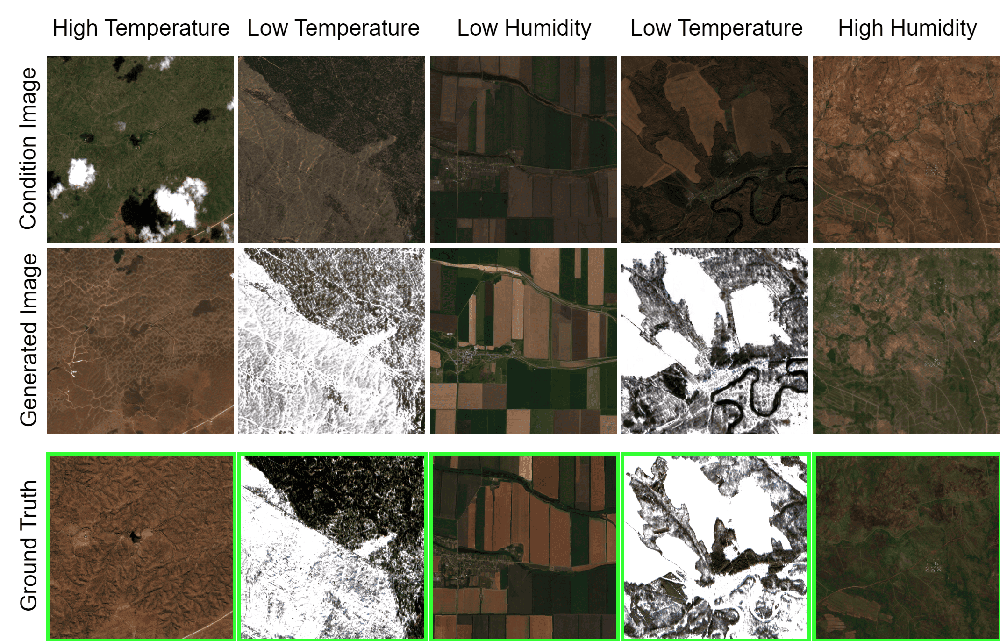

# EcoMapper: Generative Modeling for Climate-Aware Satellite Imagery (ICML 2025)
## Introduction

**EcoMapper** is a generative modeling framework designed to produce realistic, climate-aware satellite imagery using advanced diffusion models. This project combines remote sensing with climate data, leveraging a globally distributed dataset of **2.9 million Sentinel-2 images** across 15 land cover types and 6 years of monthly data.

EcoMapper features two core capabilities:

- **Text-to-Image Generation**: Uses **Stable Diffusion 3 (SD3)** to synthesize satellite images from climate-aware text prompts, incorporating location, time, land cover type, and environmental conditions such as temperature, precipitation, and solar radiation.
- **Multi-Conditional Image Generation**: Integrates **ControlNet** to guide generation with both text and image inputs, preserving spatial structures while simulating environmental changes over time.

These models enable:
- The creation of **cloud-free synthetic observations** for regions affected by persistent coverage
- Simulation of **future landscapes** under different climate scenarios
- Realistic input generation for forecasting tasks in **agriculture**, **disaster response**, and **land cover monitoring**

By fusing multimodal generative AI with Earth observation data, **EcoMapper** advances climate-aware modeling and opens up new avenues for scenario analysis, geospatial intelligence, and environmental visualization.

---

### Framework Overview


*Figure 1: Text- and image-conditioned satellite image generation using Stable Diffusion 3 and ControlNet.*

---

### Model Outputs Across Regions


*Figure 2: Satellite images generated by fine-tuned models vs. ground truth across diverse locations and land cover types.*

---

### Climate Sensitivity in Generated Imagery


*Figure 3: Effect of extreme climate inputs (e.g., dry boreal, humid tropical) on generated satellite imagery for different regions.*


## Installation
To get started, set up the environment and install the required dependencies by following the steps below:


First, clone the repository to your local machine and then create an environment to install requirements.

```bash
git clone https://github.com/maltevb/ecomapper.git
cd Ecomapper
conda create -n ecomapper python=3.10
conda activate ecomapper
pip install -r requirements.txt
```

Note: For diffusionsat related activity, visit https://github.com/samar-khanna/DiffusionSat and follow the corresponding instructions to create an appropriate environment.

## Training
EcoMapper provides different versions for training models with or without LoRA, as well as for single image generation and ControlNet. For each training session, two configuration files are needed: one for model architecture, dataset and training parameters (`config_train`), and another for the masks used for prompting (`config_caption`).

### Single Image Generation
You can train the model with or without LoRA by selecting the appropriate configuration files.

#### SD3 without LoRA
To train the model without LoRA, use the following command:
```bash
accelerate launch --mixed_precision=fp16 train.py --config_train configs/train/train.yaml --config_caption configs/caption/skip_date_location.json
```
#### SD3 with LoRA
To train the model with LoRA, use the following command:
```bash
accelerate launch --mixed_precision=fp16 train_lora.py --config_train configs/train/train_lora.yaml --config_caption configs/caption/skip_date_location.json
```

### ControlNet Image Generation
For ControlNet image generation, the process is similar: you can train the model with or without LoRA by selecting the corresponding configuration files.


#### ControlNet SD3 without LoRA
To train ControlNet without LoRA, use this command:
```bash
accelerate launch --mixed_precision=fp16 train_controlnet.py --config_train configs/train/train_controlnet.yaml --config_caption configs/caption/skip_date_location.json
```
#### ControlNet SD3 with LoRA
To train ControlNet with LoRA, run this command:
```bash
accelerate launch --mixed_precision=fp16 train_controlnet_lora.py --config_train configs/train/train_controlnet_lora.yaml --config_caption configs/caption/skip_date_location.json
```

### Inference
After training, use the validation script to generate results from the trained model. Ensure that you specify the correct model paths in the script.
#### Inference for ControlNet SD3 without LoRA

```bash
python validation/validate_controlnet.py
```
#### Inference for ControlNet SD3 with LoRA

```bash
python validation/validate_controlnet_lora.py
```

#### Computing the metrics (after validation scripts)

Notes for diffsat metrics: To compute clip score, before running batch_compute_metrics.py, insert the clip caption from the json files of the SD3 images to the json file of the diffsat images.

#### SD3
```bash
python validation/batch_compute_metrics.py
```

#### ControlNet
```bash
python validation/batch_compute_metrics_controlnet.py
```
#### Citation
If you find our project helpful, please cite our paper:
@inproceedings{goktepe2025ecomapper,
  title     = {EcoMapper: Generative Modeling for Climate‑Aware Satellite Imagery},
  author    = {G{\"o}ktepe, Muhammed and Shamseddin, Amir Hossein and Uysal, Erencan and Monteagudo, Javier and Drees, Lukas and Toker, Aysim and Asseng, Senthold and von Bloh, Malte},
  booktitle = {Proceedings of the 42nd International Conference on Machine Learning (ICML)},
  year      = {2025},
  month     = {July},
}
